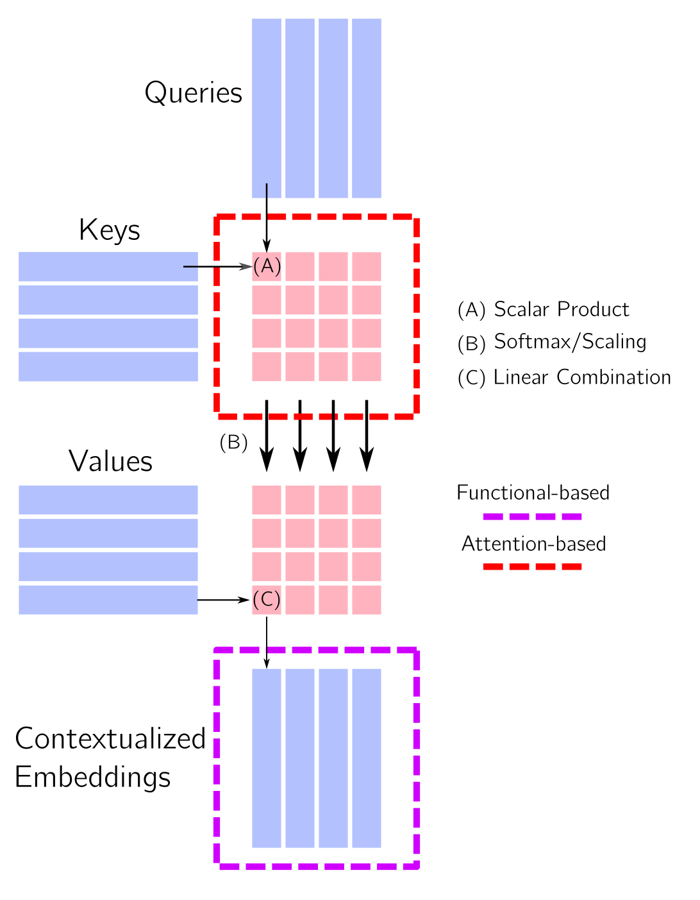
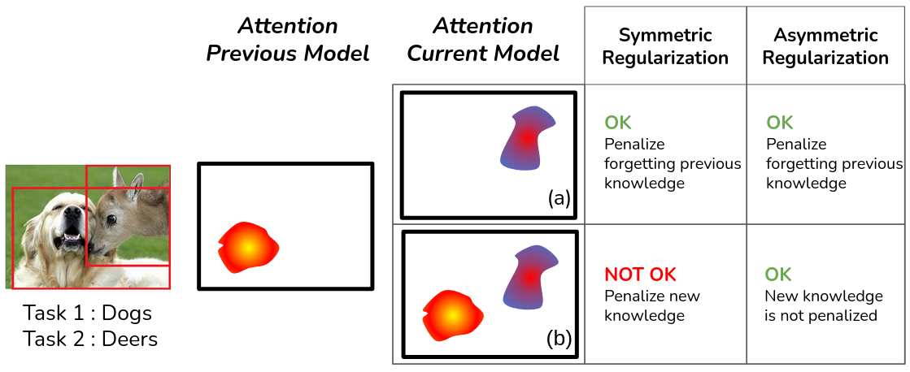

# Continual Learning with Vision Transformers

> Update: Our paper wins the best runner-up award at the [3rd CLVision workshop](https://sites.google.com/view/clvision2022/call-for-papers/accepted-papers).

This repo hosts the official implementation of our CVPR 2022 workshop paper [Towards Exemplar-Free Continual Learning in Vision Transformers: an Account of Attention, Functional and Weight Regularization](https://openaccess.thecvf.com/content/CVPR2022W/CLVision/html/Pelosin_Towards_Exemplar-Free_Continual_Learning_in_Vision_Transformers_An_Account_of_CVPRW_2022_paper.html).

TLDR; We introduce attentional and functional variants for asymmetric and symmetric Pooled Attention Distillation (PAD) losses in Vision Transformers:
<div align="center">

</div>

## Running the code

<div align="center">

</div>


Given below are two examples for the asymmetric attentional and functional variants pooling along the height dimension on ImageNet-100.
1. Attentional variant: 

  ```python
>>> python3 -u src/main_incremental.py --datasets imagenet_32_reduced --network Early_conv_vit --approach olwf_asym --nepochs $NEPOCHS --log disk --batch-size 1024 --gpu $GPU --exp-name dummy_attentional_exp --lr 0.01 --seed ${seed} --lamb 1.0 --num-tasks $NUM_TASKS --nc-first-task $NC_FIRST_TASK --lr-patience 20 --plast_mu 1.0 --pool-along 'height'   l
```
  
2. Functional variant:
 ```python
>>> python3 -u src/main_incremental.py --datasets imagenet_32_reduced --network Early_conv_vit --approach olwf_asympost --nepochs $NEPOCHS --log disk --batch-size 1024 --gpu $GPU --exp-name dummy_functional_exp --lr 0.01 --seed ${seed} --lamb 1.0 --num-tasks $NUM_TASKS --nc-first-task $NC_FIRST_TASK --lr-patience 20 --plast_mu 1.0 --pool-along 'height'   
```

The corresponding runs for symmetric variants would then be:
1. Attentional variant: 

  ```python
>>> python3 -u src/main_incremental.py --datasets imagenet_32_reduced --network Early_conv_vit --approach olwf_asym --nepochs $NEPOCHS --log disk --batch-size 1024 --gpu $GPU --exp-name dummy_attentional_exp --lr 0.01 --seed ${seed} --lamb 1.0 --num-tasks $NUM_TASKS --nc-first-task $NC_FIRST_TASK --lr-patience 20 --plast_mu 1.0 --pool-along 'height' --sym 
```
  
2. Functional variant:
 ```python
>>> python3 -u src/main_incremental.py --datasets imagenet_32_reduced --network Early_conv_vit --approach olwf_asympost --nepochs $NEPOCHS --log disk --batch-size 1024 --gpu $GPU --exp-name dummy_functional_exp --lr 0.01 --seed ${seed} --lamb 1.0 --num-tasks $NUM_TASKS --nc-first-task $NC_FIRST_TASK --lr-patience 20 --plast_mu 1.0 --pool-along 'height' --sym 
```

Other available continual learning approaches with Vision Transformers include:
<div align="center">
<p align="center"><b>
  EWC • Finetuning • LwF • PathInt 
</b></p>
</div>

The detailed scripts for our experiments can be found in `scripts/`.

## Cite
If you found our implementation to be useful, feel free to use the citation:
```bibtex
@InProceedings{Pelosin_Jha_CVPR,
    author    = {Pelosin, Francesco and Jha, Saurav and Torsello, Andrea and Raducanu, Bogdan and van de Weijer, Joost},
    title     = {Towards Exemplar-Free Continual Learning in Vision Transformers: An Account of Attention, Functional and Weight Regularization},
    booktitle = {Proceedings of the IEEE/CVF Conference on Computer Vision and Pattern Recognition (CVPR) Workshops},
    month     = {June},
    year      = {2022},
    pages     = {3820-3829}
}
```
## Acknowledgement
This repo is based on [FACIL](https://github.com/mmasana/FACIL).

<div align="center">

</div>
